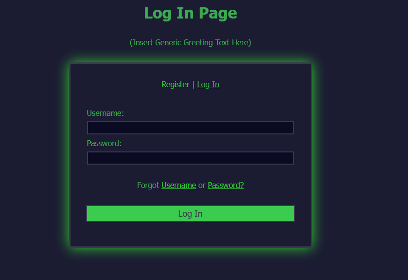

#Basic_Registration/Log_In_Page

- This is a simple project inspired by freeCodeCamp's registration form lesson.
- The password uses a simple pattern that requires 8 characters (at least one special character and one number)

##Registration Page

##Log In Page

